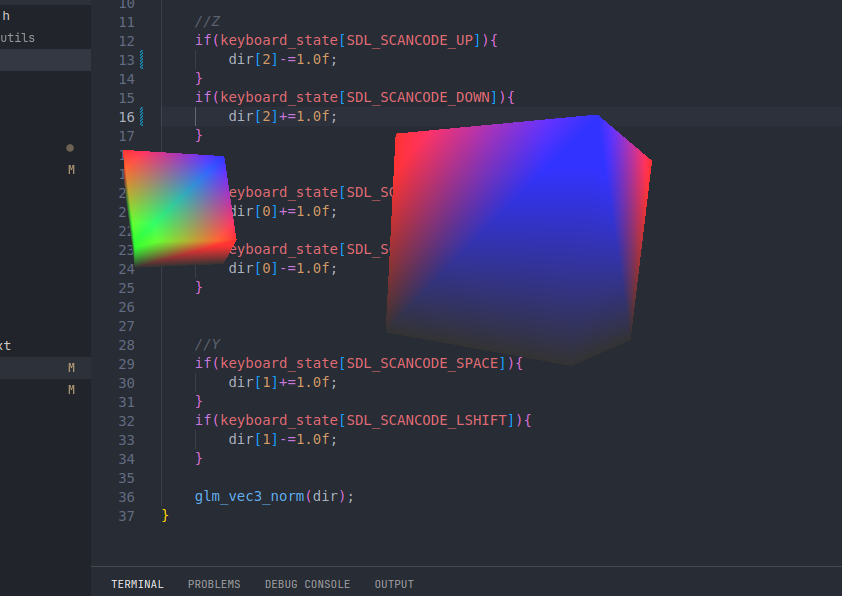

# Ember engine 

__3d Engine written on C + OpenGL.__



This engine adds some tools to work comfortably with buffers, adding and deleting the models in real time.
The goal is to create a simple and optimised engine on C.

## Models and primitive
Primitives can handle only one shader at once. One primitive usually takes one draw call.
`prim` is unique model loaded from file or created directly. 
`prim_inst` is created instance of the model. _Gonna add some optimisation - possibility for re-use vertex data in memory_
UPDATE: for now, each engine `model` is only a one `primitive` with certain material. Many models contain more than one primitive - they have to be bound using `node`, introduced by the engine.

## Batch
Used to reduce draw calls. For now each model is drawn individually, but all vertices and elements are already stored in a single buffer. After setting up materials, I want to reduce draw calls as much as possible - implementing static scenes. (WIP)
`bhandler` is responsible for working with vertex buffer `vbo` and element buffer `vao`. Also `bhandler` has access to all existing `prim_inst` elements.
The process of creating new `bhandler` is simple
```C
bhandler batch = bhandler_init(VB_CAPACITY, &vbo, EB_CAPACITY, &ebo);
```


## Node hierarchy 
Tngine implements `node` system (analogue of scenes in most engines). Each object can be bound to node and get transformed via this node. It can be useful to group meshes together (for example, player+sword mesh).
The feature of working with nodes is that nodes do not contain references to child elements. Instead, each element can refer to the parent node. When data in parent node is being changed, it automatically applies to the child node as well.
Creating the node is simple. It can be bound with another `node` or `prim_inst`
All nodes can exist independently or stored inside node_pool for safe management.

Creating free node can be unsafe, but it's fully functional:
```C
node n; node_init(&n); //creating new node
node n_child; node_init(&n_child); //creating new node
n_child->parent = &n; //binding the nodes
```

Creating nodes via `node_pool`:
```C
/*create new node pool - can be 1 or more*/
node_pool nodepool;
node_pool_init(&nodepool,NODE_MAX_NUM);
node* n = node_pool_add_node(&nodepool);

```
Transformations are being applied to `node` and it's children in real-time, it's simple:
```C
/*some silly transformations*/
n->pos[2] = -2.5f;
n->scale[0] = 0.75f;
n->rot[1] = 0.75f;
```

`node` elements are independent of `bhandler` or any OpenGL feature. They are being used only for transformations and chierarchy.

## Static scenes
The idea is to group few models in one big vertex group - they will take more space in vbo/ebo, but instead will take only one draw_call, hsaring same shader program. (WIP)


## Colorful lighting
Implement lighting (at least directional). 

## Transparency
Wish me luck.

## Reflections
NO. PLEASE NO.

